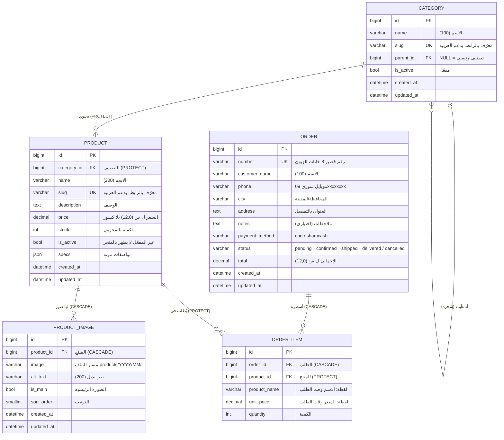

# بنية قاعدة البيانات — متجر الصَّيَّاد

> وثيقة مرجعية للشركة. تُحدَّث مع كل موديول جديد.
> آخر تحديث: 2026-07-09 — حتى M28. (موديولات Tier 2 الأربعة M25–M28 لم تضف
> أي جدول: حماية الدخول بالكاش، لوحة المبيعات تقرأ الجداول الموجودة،
> والـPWA والنسخ الاحتياطي بلا حالة بقاعدة البيانات.)

## نظرة عامة

- **محرّك قاعدة البيانات:** SQLite أثناء التطوير → **PostgreSQL** في الإنتاج
  (نفس البنية تماماً؛ Django ORM يتكفّل بالفرق).
- **تسمية الجداول:** `<app>_<model>` تلقائياً (مثل `catalog_product`).
- **كل الجداول** ترث حقلَي التوثيق الزمني:
  `created_at` (تاريخ الإنشاء) و`updated_at` (آخر تعديل).
- **المفاتيح الأساسية:** `id` رقم صحيح كبير (BigAutoField) تلقائي بكل جدول.

## مخطط العلاقات (ERD)

## الجداول بالتفصيل

### 1) `catalog_category` — التصنيفات (شجرية)

| الحقل | النوع | ملاحظات |
|---|---|---|
| `id` | BigAuto | مفتاح أساسي |
| `name` | VarChar(100) | اسم التصنيف |
| `slug` | Slug(120) | **فريد**، يُولّد تلقائياً من الاسم (يدعم العربية) |
| `parent_id` | FK → نفس الجدول | `NULL` = تصنيف رئيسي؛ غير ذلك = فرعي. حذف الأب يحذف الأبناء (CASCADE) |
| `is_active` | Boolean | إخفاء/إظهار التصنيف |
| `created_at` / `updated_at` | DateTime | تلقائي |

**قيود:** لا يتكرر نفس الاسم تحت نفس الأب (`uniq_category_name_per_parent`).
**الشجرة:** مستوى واحد أو أكثر (إلكترونيات ← سماعات ← …) بعمق حر.

### 2) `catalog_product` — المنتجات

| الحقل | النوع | ملاحظات |
|---|---|---|
| `id` | BigAuto | مفتاح أساسي |
| `category_id` | FK → category | **PROTECT**: لا يمكن حذف تصنيف فيه منتجات |
| `name` | VarChar(200) | اسم المنتج |
| `slug` | Slug(220) | **فريد**، تلقائي من الاسم، يدعم العربية |
| `description` | Text | وصف حر (اختياري) |
| `price` | Decimal(12,0) | السعر الحالي بالليرة السورية **بلا كسور** |
| `compare_at_price` | Decimal(12,0)، NULL | السعر قبل التخفيض (اختياري): إن وُجد وكان أعلى من `price` يُعتبر المنتج «بالتخفيضات» ويُعرض مشطوباً مع نسبة الخصم |
| `stock` | PositiveInt | الكمية المتوفرة |
| `is_active` | Boolean | غير المفعّل لا يظهر بالمتجر إطلاقاً |
| `specs` | JSON | مواصفات مرنة تختلف بين المنتجات: `{"اللون": "أسود"}` |
| `search_text` | Text | **نسخة مطبَّعة** من الاسم + الوصف للبحث العربي (سماعه ← سماعة، اصلي ← أصلي). تُحدَّث تلقائياً عند كل حفظ — لا تُعدَّل يدوياً |
| `created_at` / `updated_at` | DateTime | تلقائي |

**فهارس:** `(is_active, category)` لصفحات التصنيف، و`-created_at` للأحدث أولاً.
**خصائص محسوبة (ليست أعمدة):** `in_stock` = مفعّل + كمية > 0، `main_image` = أول صورة.

### 3) `catalog_productimage` — صور المنتجات

| الحقل | النوع | ملاحظات |
|---|---|---|
| `id` | BigAuto | مفتاح أساسي |
| `product_id` | FK → product | **CASCADE**: حذف المنتج يحذف صوره |
| `image` | Image | يُخزَّن الملف في `media/products/سنة/شهر/` |
| `alt_text` | VarChar(200) | وصف للصورة (وصولية + SEO) |
| `is_main` | Boolean | الصورة الرئيسية للمنتج |
| `sort_order` | SmallInt | ترتيب العرض |
| `created_at` / `updated_at` | DateTime | تلقائي |

**الترتيب الافتراضي:** الرئيسية أولاً، ثم حسب `sort_order`.

## قرارات تصميم مهمّة (ولماذا)

1. **السعر Decimal وليس Float:** أخطاء التقريب بالـFloat ممنوعة بالمال.
   بلا كسور لأن الليرة السورية عملياً لا تُستخدم بكسور.
2. **PROTECT على تصنيف المنتج:** يمنع حذف تصنيف بالغلط وضياع منتجاته —
   يجب نقل المنتجات أولاً ثم الحذف.
3. **CASCADE على صور المنتج:** الصور بلا معنى بعد حذف منتجها.
4. **`specs` JSON بدل أعمدة لكل مواصفة:** المتجر متنوّع (مثل أمازون) —
   مواصفات الغسالة غير مواصفات السماعة؛ عمود لكل مواصفة = جنون.
   JSON يبقيها مرنة، وبالمستقبل يمكن ترقيتها لجدول Attributes منفصل عند الحاجة.
5. **Slug فريد يدعم العربية:** روابط مقروءة `‎/منتج/سماعة-لاسلكية/` أفضل
   للمستخدم ولمحركات البحث من `/product/17/`.
5-مكرر. **عمود بحث مطبَّع (`search_text`):** العربية تُكتب بأشكال متعددة
   (ة/ه، أ/ا، ى/ي، بالتشكيل وبدونه). نخزّن نسخة موحّدة القواعد ونطبّع
   كلمة البحث بنفس القواعد — فيتطابقان دائماً. عند الانتقال لـPostgreSQL
   يمكن ترقيته لبحث نصّي كامل (full-text search) بلا تغيير بالواجهات.
6. **جداول Django الجاهزة** (مستخدمون، صلاحيات، جلسات) تُدار تلقائياً:
   `auth_user`, `auth_group`, `django_session`, …

### 4) `orders_order` — الطلبات

| الحقل | النوع | ملاحظات |
|---|---|---|
| `id` | BigAuto | مفتاح أساسي |
| `number` | VarChar(12) | **فريد**، 8 أرقام عشوائية — يُقرأ بسهولة عالتلفون، لا يكشف عدد طلباتك (عكس التسلسلي) |
| `customer_name` | VarChar(100) | اسم الزبون |
| `phone` | VarChar(10) | موبايل سوري `09xxxxxxxx` — يُطبَّع من الأرقام الهندية (٠٩…) تلقائياً |
| `city` | VarChar(50) | المحافظة / المدينة |
| `address` | Text | العنوان بالتفصيل |
| `notes` | Text | ملاحظات الزبون (اختياري) |
| `payment_method` | VarChar(10) | `cod` (الدفع عند الاستلام) أو `shamcash` (يُفعَّل لاحقاً) |
| `status` | VarChar(10) | `pending` بانتظار التأكيد ← `confirmed` ← `shipped` ← `delivered`، أو `cancelled` |
| `total` | Decimal(12,0) | إجمالي الطلب بالليرة — **لقطة** لحظة الشراء |
| `created_at` / `updated_at` | DateTime | تلقائي |

**فهرس:** `(status, -created_at)` — شاشة «الطلبات المعلّقة الأحدث أولاً» بلوحة التحكم.

### 5) `orders_orderitem` — أسطر الطلب

| الحقل | النوع | ملاحظات |
|---|---|---|
| `id` | BigAuto | مفتاح أساسي |
| `order_id` | FK → order | **CASCADE**: حذف الطلب يحذف أسطره |
| `product_id` | FK → product | **PROTECT**: منتج مطلوب سابقاً لا يُحذف — يُعطَّل فقط (`is_active=False`) |
| `product_name` | VarChar(200) | **لقطة**: اسم المنتج وقت الطلب |
| `unit_price` | Decimal(12,0) | **لقطة**: سعر القطعة وقت الطلب |
| `quantity` | PositiveInt | الكمية |

**لماذا اللقطات؟** الأسعار تتغيّر باستمرار؛ فاتورة الزبون يجب أن تبقى كما كانت
يوم الطلب مهما تعدّل الكاتالوج بعدها. `product_id` يبقى للربط والتقارير فقط.

### 6) `accounts_profile` — الملفات الشخصية

| الحقل | النوع | ملاحظات |
|---|---|---|
| `id` | BigAuto | مفتاح أساسي |
| `user_id` | OneToOne → auth_user | **CASCADE** — الملف يتبع الحساب |
| `role` | VarChar(10) | `customer` زبون (افتراضي) أو `merchant` تاجر |
| `phone` | VarChar(10) | موبايل سوري — هو نفسه اسم الدخول (username) |
| `city` | VarChar(50) | اختياري — يعبّي خانة المدينة عند الطلب |
| `created_at` / `updated_at` | DateTime | تلقائي |

**لماذا Profile وليس User مخصص؟** نموذج المستخدم المخصص يُختار عند بداية
المشروع فقط؛ تبديله لاحقاً جراحة هجرات خطرة. النمط القياسي البديل: User
الرسمي + ملف OneToOne. **الزائر (Guest)** ليس صفاً هنا: هو طلب بلا `user`.

### 7) `accounts_merchantprofile` — التجّار

| الحقل | النوع | ملاحظات |
|---|---|---|
| `id` | BigAuto | مفتاح أساسي |
| `user_id` | OneToOne → auth_user | CASCADE |
| `store_name` | VarChar(100) | **فريد** — اسم المتجر الظاهر للزبائن («البائع») |
| `phone` / `city` | VarChar | بيانات تواصل المتجر |
| `description` | Text | عن المتجر (اختياري) |
| `is_approved` | Boolean | يبدأ False «قيد المراجعة» — الموافقة من لوحة التحكم تمنح دخول اللوحة بمجموعة «تاجر» |
| `created_at` / `updated_at` | DateTime | تلقائي |

### 8) `orders_deliveryzone` — مناطق التوصيل ورسومها

| الحقل | النوع | ملاحظات |
|---|---|---|
| `id` | BigAuto | مفتاح أساسي |
| `name` | VarChar(50) | **فريد** — اسم المحافظة (الـ14 مزروعة بهجرة بيانات) |
| `fee` | Decimal(12,0)، NULL | **NULL = «يُتفق هاتفياً»** · 0 = توصيل مجاني · >0 = رسم يُضاف على إجمالي الطلب |
| `is_active` | Boolean | إخفاء منطقة من صفحة إتمام الطلب |
| `sort_order` | SmallInt | ترتيب الظهور بالقائمة |
| `created_at` / `updated_at` | DateTime | تلقائي |

**اللقطة:** عند الطلب يُنسخ اسم المنطقة إلى `order.city` ورسمها إلى
`order.delivery_fee` — تعديل الرسوم لاحقاً لا يمس الطلبات القديمة.

### 9) `orders_coupon` — كوبونات الخصم

| الحقل | النوع | ملاحظات |
|---|---|---|
| `id` | BigAuto | مفتاح أساسي |
| `code` | VarChar(20) | **فريد** — يُخزَّن بأحرف كبيرة تلقائياً |
| `kind` | VarChar(10) | `percent` نسبة أو `fixed` مبلغ ثابت |
| `value` | Decimal(12,0) | النسبة (1-100) أو المبلغ حسب النوع |
| `min_order_total` | Decimal، NULL | حد أدنى لمجموع المنتجات (فارغ = بلا حد) |
| `expires_at` | DateTime، NULL | انتهاء الصلاحية (فارغ = دائم) |
| `usage_limit` / `used_count` | Int | حد الاستخدامات وعدّادها — يُحجز الاستخدام بقفل صف عند إنشاء الطلب (لا صرف زائد بطلبين متزامنين) |
| `is_active` | Boolean | إيقاف الكود فوراً |

**الخصم لا يتجاوز مجموع المنتجات أبداً** (كوبون ثابت أكبر من السلة = خصم بقيمة السلة).

### أعمدة انضافت لجداول سابقة

| الجدول | العمود | ملاحظات |
|---|---|---|
| `orders_order` | `user_id` FK → auth_user، NULL | صاحب الطلب إن كان مسجَّلاً؛ **NULL = طلب زائر** (مسار مدعوم دائماً). SET_NULL: حذف الحساب لا يمس الفواتير |
| `orders_order` | `delivery_fee` Decimal(12,0)، NULL | لقطة رسم التوصيل وقت الطلب (نفس دلالات `deliveryzone.fee`)؛ `total` يشمله |
| `orders_order` | `coupon_code` VarChar(20) + `discount_amount` Decimal | لقطة الكوبون والمبلغ المخصوم فعلياً؛ `total = المنتجات − الخصم + التوصيل` |
| `catalog_product` | `merchant_id` FK → merchantprofile، NULL | البائع؛ **NULL = بضاعة الصَّيَّاد نفسه**. PROTECT: تاجر له منتجات يُعطَّل ولا يُحذف |

### مجموعات الأدوار (auth_group — تُنشأ بهجرة بيانات)

| المجموعة | الصلاحيات |
|---|---|
| مدير المتجر | كل الكاتالوج والطلبات + مراجعة التجّار (بلا إدارة مستخدمي النظام) |
| موظف الطلبات | عرض وتغيير الطلبات فقط |
| مدخل بيانات | إضافة/تعديل الكاتالوج، **بلا حذف** |
| تاجر | إضافة/تعديل منتجات — والعزل على منتجاته يفرضه كود اللوحة (ProductAdmin) |

### 10) `catalog_review` — تقييمات المنتجات

| الحقل | النوع | ملاحظات |
|---|---|---|
| `id` | BigAuto | مفتاح أساسي |
| `product_id` | FK → product | CASCADE |
| `user_id` | FK → auth_user | CASCADE — **مشترون موثَّقون فقط**: يُتحقق أن للمستخدم طلباً غير ملغى يحتوي المنتج |
| `rating` | SmallInt | 1–5 نجوم |
| `comment` | Text | اختياري |
| `is_approved` | Boolean | افتراضياً منشور؛ الإخفاء من اللوحة بدل الحذف |
| `created_at` / `updated_at` | DateTime | تلقائي |

**قيد فريد** (product, user): تقييم واحد لكل مشترٍ — إعادة الإرسال تحدّثه.

## السلة — بلا جداول (بالتصميم)

السلة تعيش في **جلسة المتصفح** (`django_session`) كقاموس `{رقم_المنتج: الكمية}` —
لا حساب ولا جدول. عند إتمام الطلب تتحوّل لسجلّي `order` + `order_item` الدائمين
داخل **معاملة ذرّية** (transaction) تقفل صفوف المنتجات، تتحقق من المخزون،
تخصمه، وتفرّغ السلة — كلها تنجح معاً أو تفشل معاً.

## القادم (مخطَّط له، غير منفّذ بعد)

| موديول | أثر على قاعدة البيانات |
|---|---|
| دمج شام كاش | حقول/جدول لعمليات الدفع (transaction id، حالة الدفع، إشعارات البوابة) — يتحدد شكله مع وثائق الـAPI |
| بحث نصّي كامل (PostgreSQL) | فهرس GIN فوق `search_text` — بلا تغيير بالواجهات |
| قائمة الأمنيات (wishlist) | جدول ربط مستخدم↔منتج |

(~~حسابات الزبائن~~ نُفّذت في M16 — انظر `accounts_profile` والعمود
`orders_order.user_id` أعلاه.)
