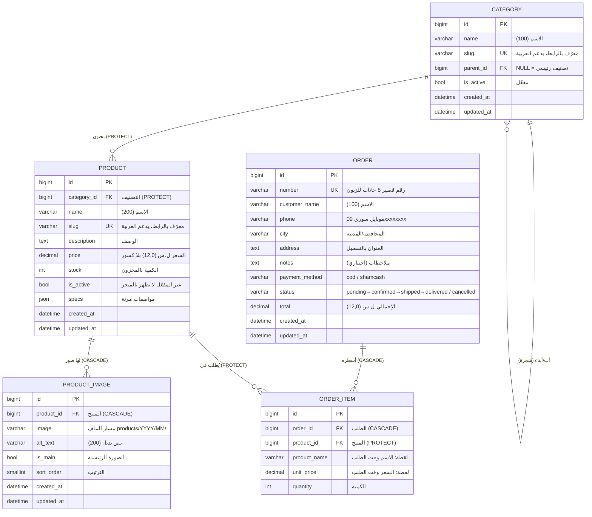

# بنية قاعدة البيانات — متجر الصَّيَّاد

> وثيقة مرجعية للشركة. تُحدَّث مع كل موديول جديد.
> آخر تحديث: 2026-07-02 — بعد الموديول M6 (الطلبات وإتمام الشراء).

## نظرة عامة

- **محرّك قاعدة البيانات:** SQLite أثناء التطوير → **PostgreSQL** في الإنتاج
  (نفس البنية تماماً؛ Django ORM يتكفّل بالفرق).
- **تسمية الجداول:** `<app>_<model>` تلقائياً (مثل `catalog_product`).
- **كل الجداول** ترث حقلَي التوثيق الزمني:
  `created_at` (تاريخ الإنشاء) و`updated_at` (آخر تعديل).
- **المفاتيح الأساسية:** `id` رقم صحيح كبير (BigAutoField) تلقائي بكل جدول.

## مخطط العلاقات (ERD)

## الجداول بالتفصيل

### 1) `catalog_category` — التصنيفات (شجرية)

| الحقل | النوع | ملاحظات |
|---|---|---|
| `id` | BigAuto | مفتاح أساسي |
| `name` | VarChar(100) | اسم التصنيف |
| `slug` | Slug(120) | **فريد**، يُولّد تلقائياً من الاسم (يدعم العربية) |
| `parent_id` | FK → نفس الجدول | `NULL` = تصنيف رئيسي؛ غير ذلك = فرعي. حذف الأب يحذف الأبناء (CASCADE) |
| `is_active` | Boolean | إخفاء/إظهار التصنيف |
| `created_at` / `updated_at` | DateTime | تلقائي |

**قيود:** لا يتكرر نفس الاسم تحت نفس الأب (`uniq_category_name_per_parent`).
**الشجرة:** مستوى واحد أو أكثر (إلكترونيات ← سماعات ← …) بعمق حر.

### 2) `catalog_product` — المنتجات

| الحقل | النوع | ملاحظات |
|---|---|---|
| `id` | BigAuto | مفتاح أساسي |
| `category_id` | FK → category | **PROTECT**: لا يمكن حذف تصنيف فيه منتجات |
| `name` | VarChar(200) | اسم المنتج |
| `slug` | Slug(220) | **فريد**، تلقائي من الاسم، يدعم العربية |
| `description` | Text | وصف حر (اختياري) |
| `price` | Decimal(12,0) | السعر بالليرة السورية **بلا كسور** |
| `stock` | PositiveInt | الكمية المتوفرة |
| `is_active` | Boolean | غير المفعّل لا يظهر بالمتجر إطلاقاً |
| `specs` | JSON | مواصفات مرنة تختلف بين المنتجات: `{"اللون": "أسود"}` |
| `created_at` / `updated_at` | DateTime | تلقائي |

**فهارس:** `(is_active, category)` لصفحات التصنيف، و`-created_at` للأحدث أولاً.
**خصائص محسوبة (ليست أعمدة):** `in_stock` = مفعّل + كمية > 0، `main_image` = أول صورة.

### 3) `catalog_productimage` — صور المنتجات

| الحقل | النوع | ملاحظات |
|---|---|---|
| `id` | BigAuto | مفتاح أساسي |
| `product_id` | FK → product | **CASCADE**: حذف المنتج يحذف صوره |
| `image` | Image | يُخزَّن الملف في `media/products/سنة/شهر/` |
| `alt_text` | VarChar(200) | وصف للصورة (وصولية + SEO) |
| `is_main` | Boolean | الصورة الرئيسية للمنتج |
| `sort_order` | SmallInt | ترتيب العرض |
| `created_at` / `updated_at` | DateTime | تلقائي |

**الترتيب الافتراضي:** الرئيسية أولاً، ثم حسب `sort_order`.

## قرارات تصميم مهمّة (ولماذا)

1. **السعر Decimal وليس Float:** أخطاء التقريب بالـFloat ممنوعة بالمال.
   بلا كسور لأن الليرة السورية عملياً لا تُستخدم بكسور.
2. **PROTECT على تصنيف المنتج:** يمنع حذف تصنيف بالغلط وضياع منتجاته —
   يجب نقل المنتجات أولاً ثم الحذف.
3. **CASCADE على صور المنتج:** الصور بلا معنى بعد حذف منتجها.
4. **`specs` JSON بدل أعمدة لكل مواصفة:** المتجر متنوّع (مثل أمازون) —
   مواصفات الغسالة غير مواصفات السماعة؛ عمود لكل مواصفة = جنون.
   JSON يبقيها مرنة، وبالمستقبل يمكن ترقيتها لجدول Attributes منفصل عند الحاجة.
5. **Slug فريد يدعم العربية:** روابط مقروءة `‎/منتج/سماعة-لاسلكية/` أفضل
   للمستخدم ولمحركات البحث من `/product/17/`.
6. **جداول Django الجاهزة** (مستخدمون، صلاحيات، جلسات) تُدار تلقائياً:
   `auth_user`, `auth_group`, `django_session`, …

### 4) `orders_order` — الطلبات

| الحقل | النوع | ملاحظات |
|---|---|---|
| `id` | BigAuto | مفتاح أساسي |
| `number` | VarChar(12) | **فريد**، 8 أرقام عشوائية — يُقرأ بسهولة عالتلفون، لا يكشف عدد طلباتك (عكس التسلسلي) |
| `customer_name` | VarChar(100) | اسم الزبون |
| `phone` | VarChar(10) | موبايل سوري `09xxxxxxxx` — يُطبَّع من الأرقام الهندية (٠٩…) تلقائياً |
| `city` | VarChar(50) | المحافظة / المدينة |
| `address` | Text | العنوان بالتفصيل |
| `notes` | Text | ملاحظات الزبون (اختياري) |
| `payment_method` | VarChar(10) | `cod` (الدفع عند الاستلام) أو `shamcash` (يُفعَّل لاحقاً) |
| `status` | VarChar(10) | `pending` بانتظار التأكيد ← `confirmed` ← `shipped` ← `delivered`، أو `cancelled` |
| `total` | Decimal(12,0) | إجمالي الطلب بالليرة — **لقطة** لحظة الشراء |
| `created_at` / `updated_at` | DateTime | تلقائي |

**فهرس:** `(status, -created_at)` — شاشة «الطلبات المعلّقة الأحدث أولاً» بلوحة التحكم.

### 5) `orders_orderitem` — أسطر الطلب

| الحقل | النوع | ملاحظات |
|---|---|---|
| `id` | BigAuto | مفتاح أساسي |
| `order_id` | FK → order | **CASCADE**: حذف الطلب يحذف أسطره |
| `product_id` | FK → product | **PROTECT**: منتج مطلوب سابقاً لا يُحذف — يُعطَّل فقط (`is_active=False`) |
| `product_name` | VarChar(200) | **لقطة**: اسم المنتج وقت الطلب |
| `unit_price` | Decimal(12,0) | **لقطة**: سعر القطعة وقت الطلب |
| `quantity` | PositiveInt | الكمية |

**لماذا اللقطات؟** الأسعار تتغيّر باستمرار؛ فاتورة الزبون يجب أن تبقى كما كانت
يوم الطلب مهما تعدّل الكاتالوج بعدها. `product_id` يبقى للربط والتقارير فقط.

## السلة — بلا جداول (بالتصميم)

السلة تعيش في **جلسة المتصفح** (`django_session`) كقاموس `{رقم_المنتج: الكمية}` —
لا حساب ولا جدول. عند إتمام الطلب تتحوّل لسجلّي `order` + `order_item` الدائمين
داخل **معاملة ذرّية** (transaction) تقفل صفوف المنتجات، تتحقق من المخزون،
تخصمه، وتفرّغ السلة — كلها تنجح معاً أو تفشل معاً.

## القادم (مخطَّط له، غير منفّذ بعد)

| موديول | أثر على قاعدة البيانات |
|---|---|
| دمج شام كاش | حقول/جدول لعمليات الدفع (transaction id، حالة الدفع، إشعارات البوابة) — يتحدد شكله مع وثائق الـAPI |
| حسابات الزبائن (اختياري مستقبلاً) | ربط `order` بـ`auth_user` لعرض «طلباتي» |
